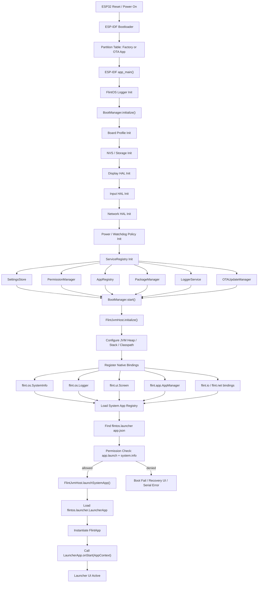
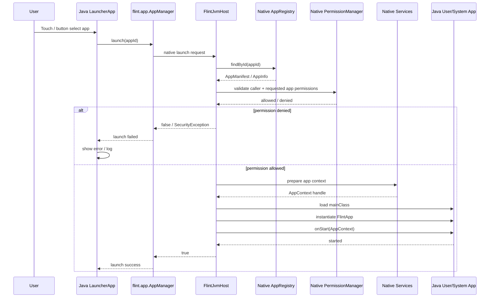
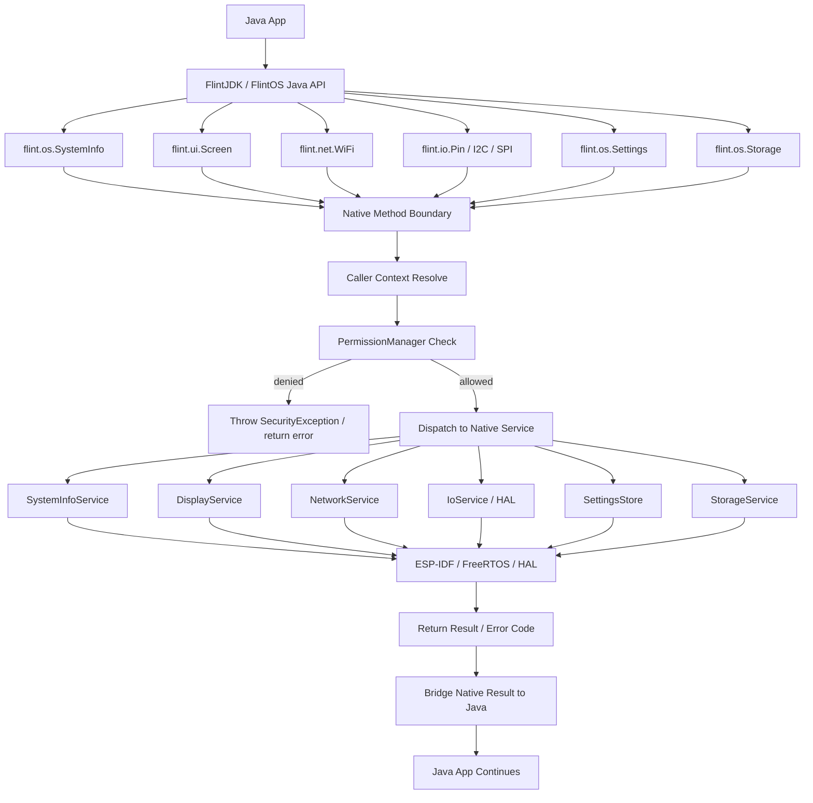
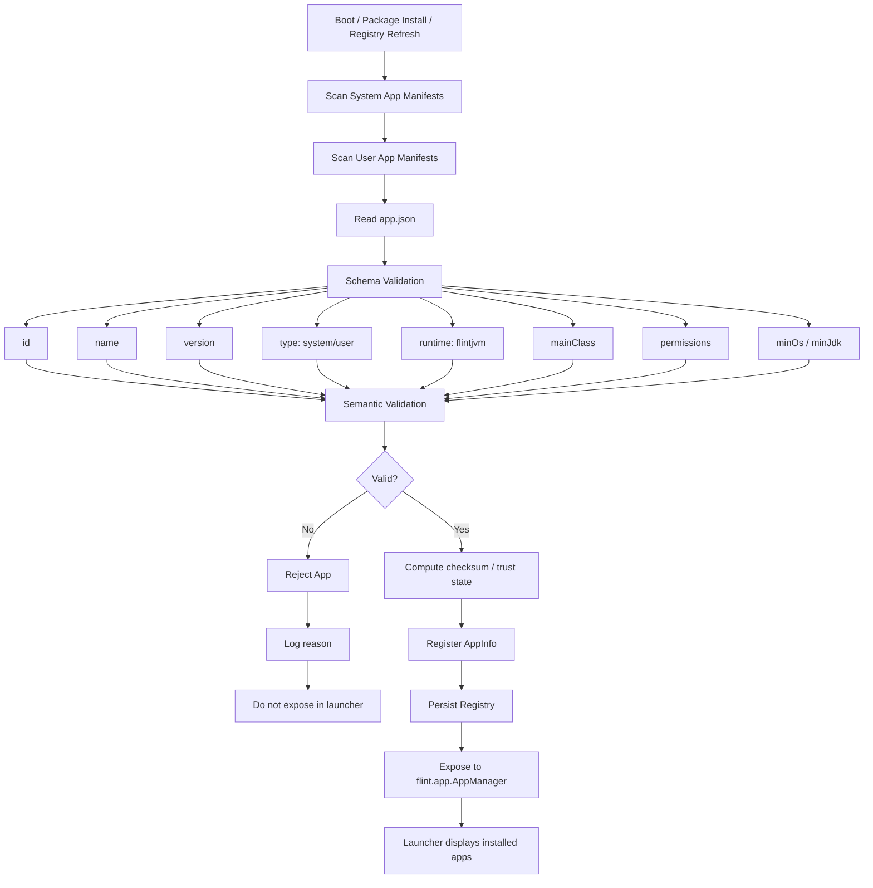
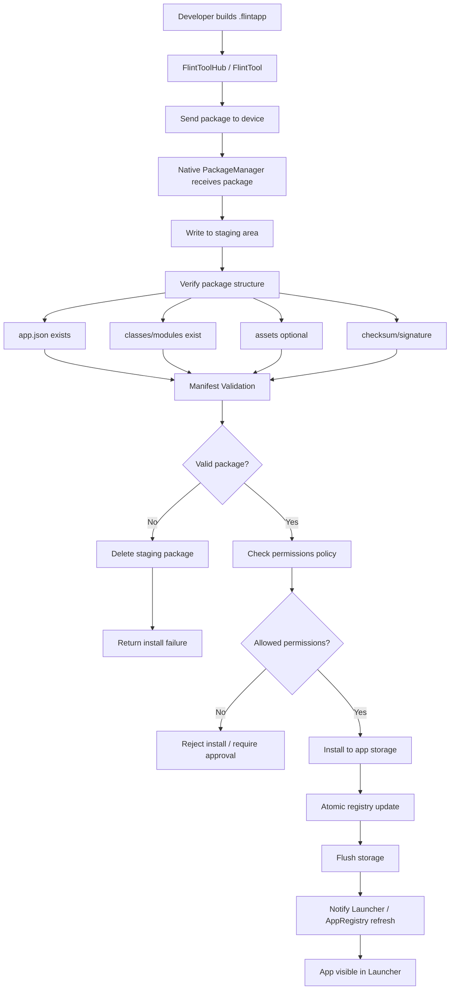
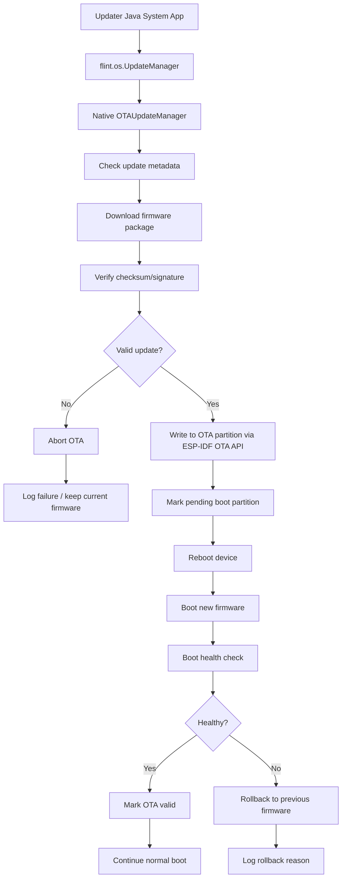
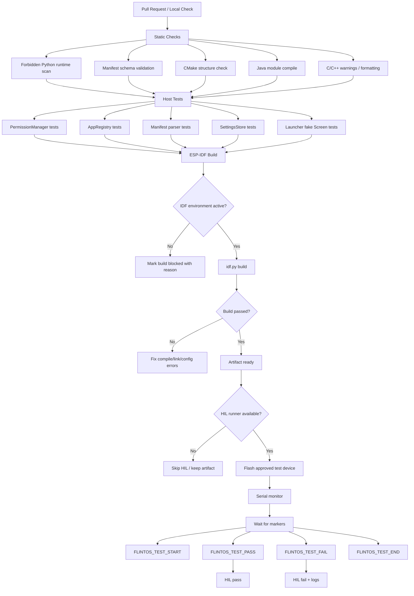
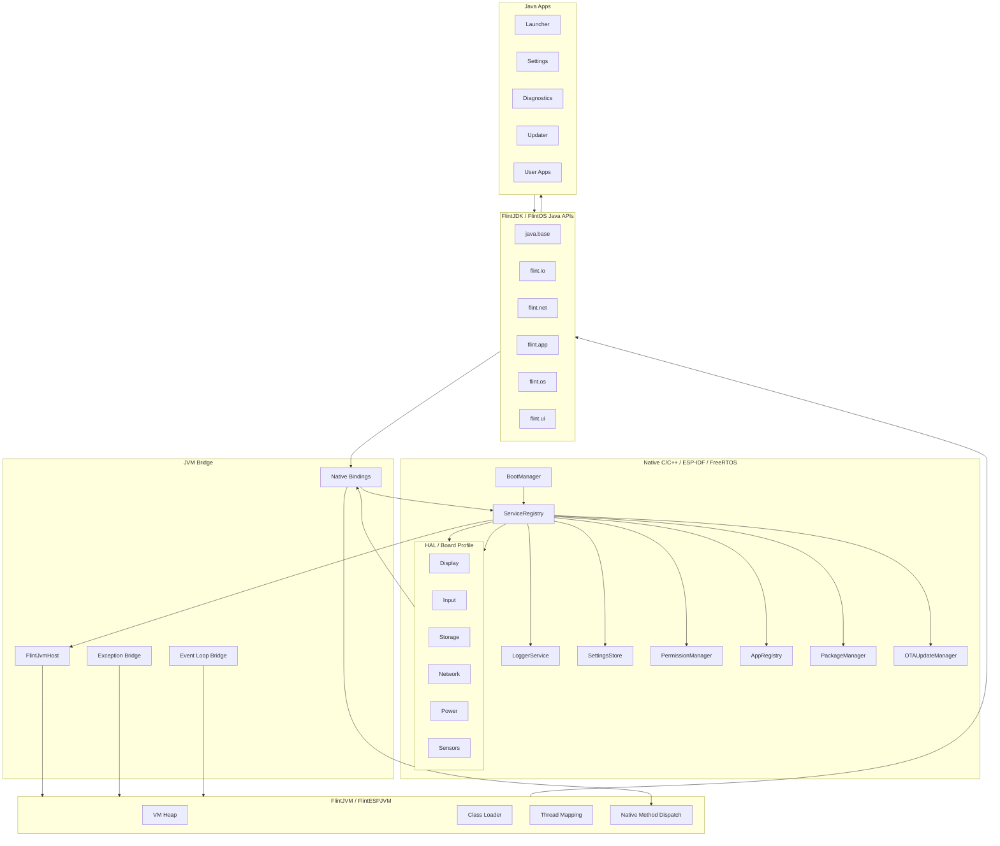
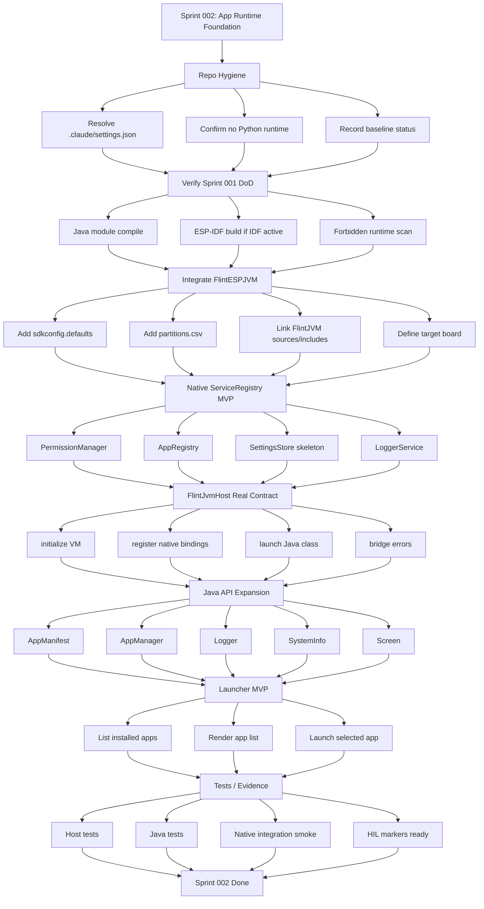

# FlintOS Process Flow

This document captures the execution flows for FlintOS as a Java/native embedded operating environment.

See also `MICROPYTHONOS_REFERENCE_ALIGNMENT.md` for the product-reference mapping from MicroPythonOS docs into FlintOS Java/native flows.

FlintOS uses MicroPythonOS only as product/UX inspiration for a thin app-centric OS, launcher, app store/catalog, OTA, touch UI, multi-device feel, and lightweight embedded experience. FlintOS does **not** use Python or MicroPython as runtime, app runtime, system API layer, service layer, or boot implementation.

## 1. Boot flow: ESP-IDF to Java Launcher

## 2. App launch flow

## 3. Java native API call flow

## 4. App registry and manifest validation flow

## 5. Package install flow

## 6. OTA update flow

## 7. Testing, CI, and HIL flow

## 8. Overall architecture flow

## 9. Sprint 002 runtime foundation flow

